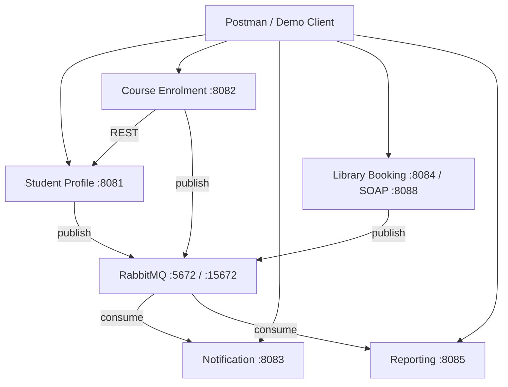

# SmartCampus Connect

SmartCampus Connect is a distributed backend platform for university campus services. It comprises five independent Spring Boot microservices, RabbitMQ asynchronous messaging, database-per-service isolation, JAX-WS SOAP integration, and Docker Compose deployment.

---

## 🚀 D2 Submission Compliance Check
*   **Clean Machine Setup Time:** Less than 15 minutes.
*   **Single-Command Build Options:**
    *   **Option A (Dockerized build & run):** `docker compose up --build`
    *   **Option B (Local Maven compile):** `mvn clean install -DskipTests` (or run `.\build.ps1`)

---

## 1. Project Overview

**Problem:** Campus operations (student records, enrolment, notifications, library, analytics) need to scale independently and remain available during partial failures.

**Solution:** A service-oriented microservice architecture where each bounded context owns its data, communicates via REST (sync) and RabbitMQ (async), and can be deployed as containers.

---

## 2. Architecture



**Patterns used:**
- **Orchestration:** Course Enrolment validates student → checks capacity → saves → publishes event
- **Choreography:** Notification and Reporting react independently to RabbitMQ events

---

## 3. Services

| Service | Port | Database | Responsibility |
|---------|------|----------|----------------|
| Student Profile | 8081 | `student_db` | Student CRUD |
| Course Enrolment | 8082 | `enrolment_db` | Enrol/drop, capacity, circuit breaker |
| Notification | 8083 | `notification_db` | Consume events, notification history |
| Library / Booking | 8084 (+ SOAP 8088) | `library_db` | Book loans, room bookings, SOAP |
| Reporting / Analytics | 8085 | `reporting_db` | Event-driven aggregates |
| RabbitMQ | 5672, 15672 | — | Async messaging broker |

---

## 4. Tech Stack

- Java 17, Spring Boot 3.2, Spring Data JPA
- RabbitMQ (Spring AMQP), JAX-WS SOAP
- H2 (local dev) / PostgreSQL 16 (Docker)
- Maven multi-module, Docker Compose
- Postman collection for API testing

---

## 5. Port Mapping

| Component | Host Port |
|-----------|-----------|
| Student Profile | 8081 |
| Course Enrolment | 8082 |
| Notification | 8083 |
| Library REST | 8084 |
| Library SOAP | 8088 |
| Reporting | 8085 |
| RabbitMQ AMQP | 5672 |
| RabbitMQ UI | 15672 |
| PostgreSQL (student) | 5433 |
| PostgreSQL (enrolment) | 5434 |
| PostgreSQL (notification) | 5435 |
| PostgreSQL (library) | 5436 |
| PostgreSQL (reporting) | 5437 |

---

## 6. Quick Start (under 15 minutes)

### Option A — Docker Compose (recommended for markers)

```powershell
docker compose up --build
```

Wait until all health checks pass, then test:

- Student API: http://localhost:8081/api/students
- Reporting: http://localhost:8085/api/reports/enrolment-summary
- RabbitMQ UI: http://localhost:15672 (guest/guest)
- SOAP WSDL: http://localhost:8088/ws/library?wsdl

### Option B — Local Windows (XAMPP MySQL + RabbitMQ)

Follow this step-by-step tutorial to start all services manually:

#### Step 1: Start XAMPP MySQL Database
1. Open the Windows Start Menu, search for **XAMPP Control Panel**, and launch it.
2. In the XAMPP Control Panel, click the **Start** button next to **MySQL**.
3. (Optional) Click the **Start** button next to **Apache** if you want database visualization access in the browser.
4. Ensure MySQL is running on port **3306** (default) with username **root** and **no password**.
5. *Note: You do NOT need to create the database schemas manually. The microservices will auto-generate them (`studentdb`, `enrolmentdb`, `librarydb`, `notificationdb`, `reportingdb`) on startup.*

#### Step 2: Open Docker Desktop and Start RabbitMQ
1. Open **Docker Desktop** on your computer.
2. Once Docker is fully loaded and running, open a **PowerShell** terminal window at the root folder of this project (`c:\Users\pirat\OneDrive\Documents\DAD\Project`).
3. Run the following command in PowerShell to spin up the RabbitMQ messaging broker container:
   ```powershell
   docker compose up -d rabbitmq
   ```
4. Wait a few seconds for the RabbitMQ broker container to complete startup on port `5672` (management dashboard on `15672`).

#### Step 3: Compile the Project in PowerShell
1. In the same PowerShell terminal window, compile and package all microservices by running:
   ```powershell
   .\build.ps1
   ```
   *(This triggers `mvn clean install -DskipTests` to package all service jar files).*

#### Step 4: Run the Microservices
1. Start the microservice stack by running the run script:
   ```powershell
   .\run.ps1
   ```
2. The script will open multiple separate PowerShell console windows running each individual Spring Boot service (Student API on port 8081, Enrolment on 8082, Notification on 8083, Library REST/SOAP on 8084/8088, and Reporting on 8085).
3. Do not close these windows. If you want to stop all services, return to the main script terminal window and press any key to automatically close all running Java processes.

#### Step 5: Test and Verify
1. Double-click the file `frontend/index.html` or open it in your browser (it will load the Student Registry by default).
2. Go to [http://localhost/phpmyadmin](http://localhost/phpmyadmin) in your browser to verify that the databases and tables are fully populated.

---

## 7. Maven Build

```powershell
mvn clean install -DskipTests
```

Modules:

```
smartcampus-parent/
├── shared-messaging/      # CampusEvent, RabbitMQ config, EventPublisher
├── student-service/
├── enrolment-service/
├── notification-service/
├── library-service/
├── reporting-service/
└── load-test/
```

---

## 8. RabbitMQ

| Item | Value |
|------|-------|
| Exchange | `smartcampus.events` (topic) |
| Notification queue | `notification.events.queue` |
| Reporting queue | `reporting.events.queue` |
| Routing keys | `enrolment.*`, `library.*`, `student.*`, `loadtest.*` |
| DLQ | `smartcampus.dlq` |

**Publishers:** Student Profile, Course Enrolment, Library  
**Consumers:** Notification, Reporting

Example event:

```json
{
  "eventId": "uuid",
  "eventType": "ENROLMENT_CREATED",
  "routingKey": "enrolment.created",
  "source": "course-enrolment-service",
  "data": { "studentId": "S1001", "courseCode": "CSE301", "programme": "Computer Science" }
}
```

---

## 9. SOAP Service

- **WSDL:** http://localhost:8088/ws/library?wsdl
- **Operations:** `bookLoan`, `reserveRoom`
- **Fault demo:** Loan the same book twice → `BookAlreadyLoanedFault`

---

## 10. REST Endpoints (summary)

| Service | Key Endpoints |
|---------|---------------|
| Student | `GET/POST/PUT/DELETE /api/students`, `/api/students/{id}` |
| Enrolment | `POST /api/enrolments`, `DELETE /api/enrolments/{id}`, `GET /api/enrolments/circuit-breaker` |
| Notification | `GET /api/notifications`, `GET /api/notifications/count` |
| Library | `POST /api/loans`, `POST /api/bookings`, `GET /api/bookings` |
| Reporting | `GET /api/reports/enrolment-summary`, `/api/reports/metrics` |

Full Postman pack: `postman/SmartCampus_Connect.postman_collection.json`

---

## 11. Failure Handling

| Mechanism | Where | Demo |
|-----------|-------|------|
| Client timeout (1s/2s) | Enrolment → Student | Stop student service |
| Retry + backoff (3×) | Enrolment → Student | Watch logs |
| Circuit breaker | Enrolment → Student | `GET /api/enrolments/circuit-breaker` |
| Graceful degradation | Enrolment cache / PROVISIONAL | Enrol cached student while profile offline |

Enrolment completes even if Notification is down — events queue in RabbitMQ.

---

## 12. Multithreading / Concurrency

- **Notification Service:** RabbitMQ listener pool (5–10 threads) + `ReentrantLock` on shared event counter
- **Course Enrolment:** `synchronized` enrolment method protects course capacity counters
- **Load test:**

```powershell
mvn exec:java -pl load-test
```

Publishes 50 concurrent RabbitMQ events; asserts notification count == 50.

---

## 13. End-to-End Workflow

1. `POST /api/students` → create S1004  
2. `POST /api/enrolments` → validate student, publish `enrolment.created`  
3. Notification consumes event → row in `notification_db`  
4. Reporting consumes event → updates programme stats  
5. `GET /api/reports/enrolment-summary` → shows aggregated data  
6. `POST /api/bookings` → publishes `library.booking.created`

Run folder **6. End-to-End Workflow** in Postman.

---

## 14. Demo Client Recommendation

**Best for assignment:** Postman collection (included).  
Optional: import the collection and run the E2E folder during presentation. A full React frontend is not required.

---

## 15. Repository Structure

| Module | Owner suggestion |
|--------|------------------|
| `student-service` | Team member A |
| `enrolment-service` | Team member B |
| `notification-service` | Team member C |
| `library-service` | Team member D |
| `reporting-service` + `docker-compose.yml` | Team member E |
| `postman/`, `README.md` | Shared |

---

## Report Writing Guide

### System characterisation / transparency
Explain location transparency (service ports/containers), access transparency (REST/JSON + SOAP/XML), failure transparency (circuit breaker, provisional enrolment), and concurrency transparency (locks + thread pools).

### Architecture pattern selection
Justify microservices + database-per-service for independent scaling; orchestration for enrolment consistency; choreography via RabbitMQ for notifications and analytics.

### SOA principles
Each service is a autonomous unit with explicit contracts (REST OpenAPI-style endpoints, SOAP WSDL, event JSON schema in `CampusEvent`).

### Service composition
Course Enrolment orchestrates Student Profile validation synchronously, then composes async side effects through events.

### Distributed messaging
RabbitMQ topic exchange decouples publishers from consumers; idempotent consumers use `eventId` deduplication.

### SOAP usage
Library exposes legacy-compatible SOAP for interoperability demonstration alongside REST.

### Failure handling
Document timeout → retry → circuit breaker → cache fallback chain with demo steps in section 11.

### Multithreaded server
Describe RabbitMQ listener concurrency + `ReentrantLock` on `NotificationRegistry` and back with load test output.

---

## Troubleshooting

| Issue | Fix |
|-------|-----|
| Services fail to connect to RabbitMQ | Run `docker compose up -d rabbitmq` or full stack |
| Empty reporting data | Complete an enrolment first; wait 2s for consumer |
| SOAP connection refused | Ensure library service running; check port 8088 |
| Docker build slow | First build downloads Maven deps (~5 min); subsequent builds are faster |
